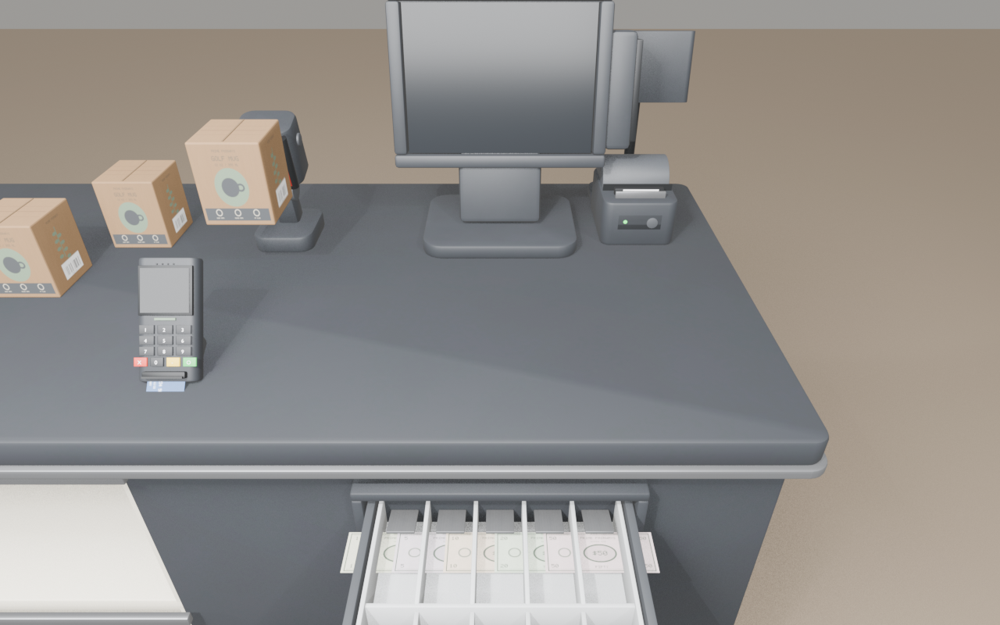
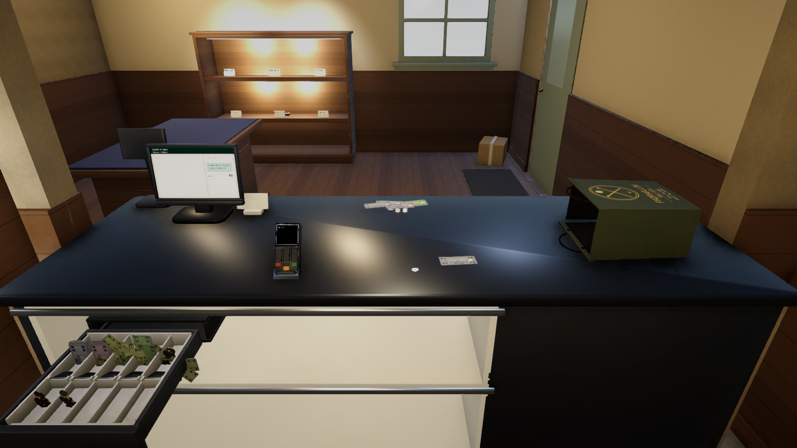
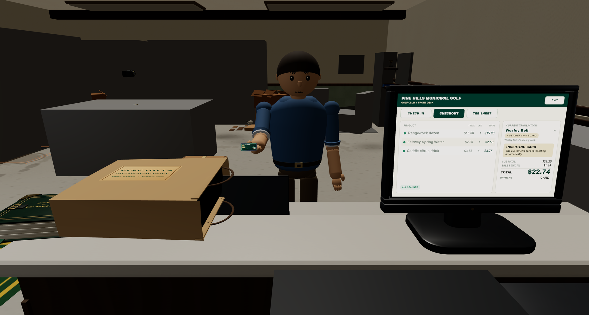
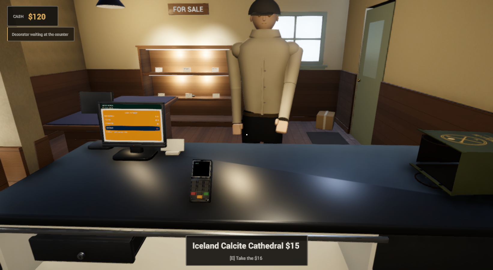
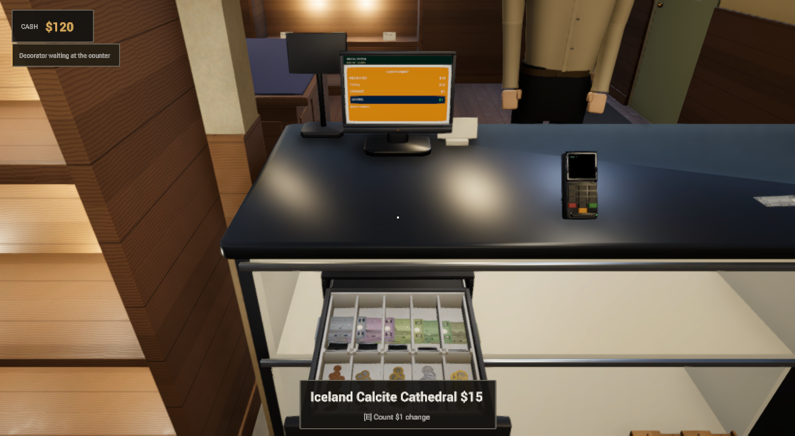
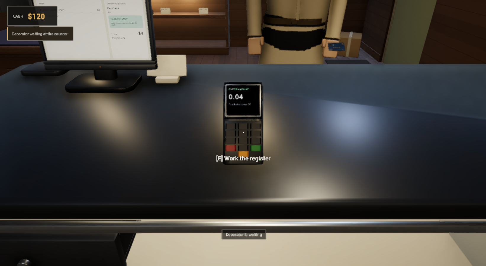
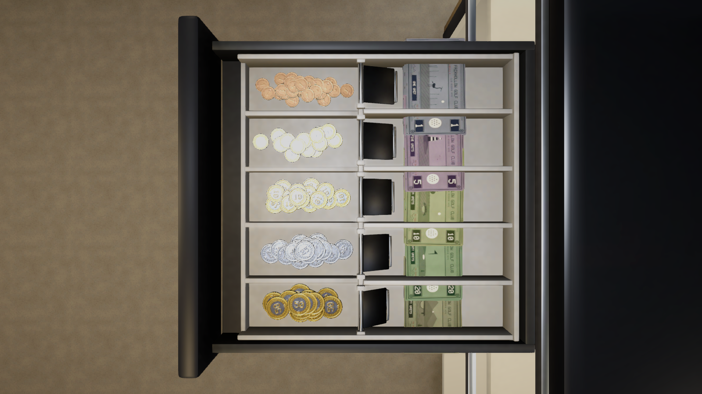
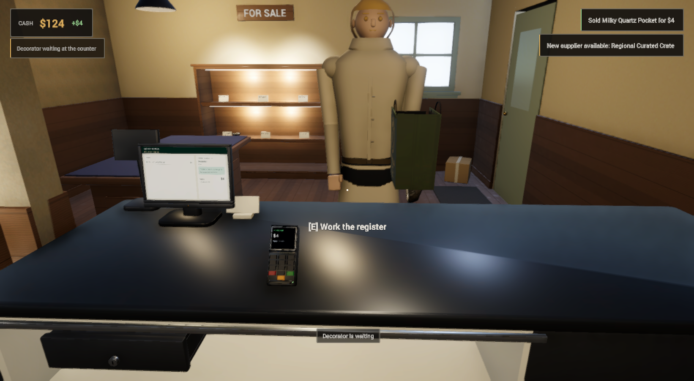

# Golf checkout port — what was carried across, and how it was checked

The Geode checkout is now the Golf Simulator checkout: its assets, its transaction rules, its 30-state physical
contract, and the constants its playtests set. What follows is the record of what came across, what was deliberately
left behind, and the frames the result was judged on.

## The assets

`Tools/Blender/import_golf_checkout.py` converts the authored GLBs from `Golf-Simulator/Assets/checkout/glb` into
Unity-ready FBX under `Geode/Assets/GeodeEmpire/Models/Checkout`, extracts their embedded textures, and writes a
typed manifest (`checkout_kit.json`) carrying every node's transform and its authored extras. The conversion is
deterministic and re-runnable: animation is cleared and nodes are returned to their rest pose first, because the kit
ships drawer clips and the tray otherwise exported permanently open.

`CheckoutKitBuilder` then rebuilds the URP materials from the authored glTF PBR values and makes one prefab per
model. Each prefab carries a `CheckoutRig` whose serialized `Transform` references bind every anchor, socket, screen,
terminal key and drawer well. That is the replacement for Golf's node-name lookups: a renamed node breaks the build
instead of silently failing at runtime.

Carried across: `checkout_counter`, `pos_monitor`, `payment_terminal`, `cash_drawer`, `payment_card`, `shopping_bag`,
`customer_display`, `cash_handoff_stack`, five bill models and six coin models, and the 27 textures they use.

## The domain

Transliterated, not redesigned:

| From Golf | In Geode |
|---|---|
| integer-cent currency, stacks, greedy `makeChange`, the bounded-drawer DP `makeChangeFrom`, `customerCash`, `payableInLargeCoins`, `newDrawer`, the migrations | `Money.cs` |
| the 30 states with their cameras, prompts, audio cues, timeouts, recovery resolvers and `validateCheckoutContract` | `CheckoutFlow.cs` |
| `tx.stage`, the card sub-machine, the cash sub-machine, the change window and `MAX_EXTRA_CHANGE_CENTS`, `drawerCommitFor` | `RegisterTransaction.cs` |
| `drawerMoneyLayout.js` | `DrawerMoneyLayout.cs` |
| `checkoutPaymentPresentation.js`, `bagFitPlan`/`bagPlacementFor` | `CheckoutPresentation.cs` |
| `REGISTER` datums, the derived camera poses, the playtest constants | `CounterLayout.asset` |

Deliberately not ported, because Geode already provides the guarantee or the concept does not exist here: the
write-ahead settlement log (a Geode sale banks through `GameSession`/`RetailShop`, which writes the career
atomically and marks the specimen `Sold` by identity exactly once), the lot-level inventory lifecycle (a Geode
specimen is a single identified object, not a lot), sales tax, customer history, reservations and green fees, the
manual WebGL resource ledgers, and the legacy direct-sale path.

Two Golf decisions were kept as decisions, not as code: a body too big for the carrier is not bagged (Geode reads
the specimen's size class, the way Golf read `separateHandoff`), and the terminal opens at 0.00 so that keying the
amount is the interaction.

## The frames

Golf's own reference, then the same moment in Geode.

| Golf | Geode |
|---|---|
|  |  |
|  |  |

The rest of the sale:

| | |
|---|---|
|  |  |
|  |  |

## What was checked

- 23 EditMode tests over the ported domain; the whole suite is green at 68.
- Cash and card sales on small, medium and large specimens: cash banked, the till's own contents move by the same
  amount on a cash sale and not at all on a card sale, the record is `Sold`, the customer and the entity leave, the
  station returns to idle and nothing is left on the counter.
- Three customers back to back, all balancing.
- A whole sale worked with nothing but the interact button and the target cycle, which is the controller path.
- Save integrity: stock survives a reload with its prices, a reserved piece goes back on the shelf, a sold piece
  stays sold and cannot be sold twice.
- A close-up pass over every prop for clipping.

## Faults this port found

- Unity's `??` treats a missing component as present, so `GetComponent<T>() ?? AddComponent<T>()` never adds.
- `MonoBehaviour` already owns `Reset()`; a public method of that name is called by the editor as the component is
  added, which wiped the station while the scene was being built.
- A serialized transaction came back from the scene asset as a live half-sale. Runtime state is explicitly
  `[NonSerialized]` now.
- The kit's drawer nodes carry a baked axis conversion: taking their local axes at face value slid the tray up
  through the counter top and stood every note on its edge.
- The $20 note well and the quarter's well share the authored denomination "20", so they fought over one socket.
- A shopper who left the shop kept their place in the queue, so the next one never reached the counter.
